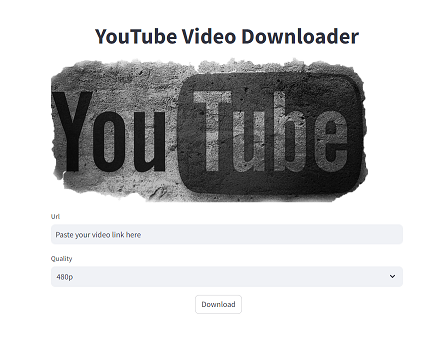

# YouTube Downloader with Pytube and Streamlit

This is a simple YouTube downloader web application built using Pytube and Streamlit. It allows users to download YouTube videos by providing the video URL.

## Installation

1. Clone the repository:

      git clone git@github.com:ZahraFouladian/YoutubeDownloader.git
   

2. Navigate to the project directory:

      cd Youtube Downloader  with streamlit
   

3. Install the required dependencies:

      pip install -r requirements.txt
   

## Usage

1. Run the Streamlit app:

      streamlit run src/app.py
   

2. Open your web browser and go to http://localhost:8502 to access the YouTube downloader application.

3. Paste the URL of the YouTube video you want to download and click on the "Download" button.

4. The video will be downloaded to video folder in src.

